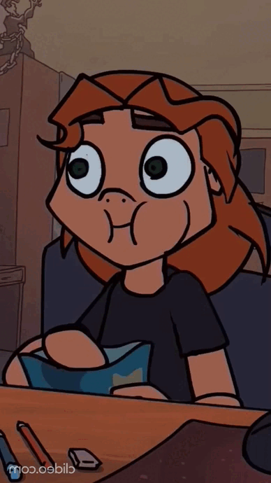

      

        
      

      

      <h2>
        <picture
          ></picture>
        / About me /
      </h2>

      <ul>
        <li>💻 I'm a Frontend Developer.</li>
        <li>🚀 I'm an Industrial Manager.</li>
        <li>👨‍👩‍👧‍👧 I like working in a team.</li>
        <li>🤘🏽🎸 I like classic rock.</li>
        <li>☕ I love coffee.</li>
      </ul>

      <h2>
        <picture
          ></picture>
        / Current skills /
      </h2>

      

        
        
        
        
      

      <h2>✉️ / How to reach me / :</h2>

      

        <ul>
          <li>
            
          </li>

           

          <li>
            
          </li>

           

          <li>
            
          </li>
        </ul>
      

    

